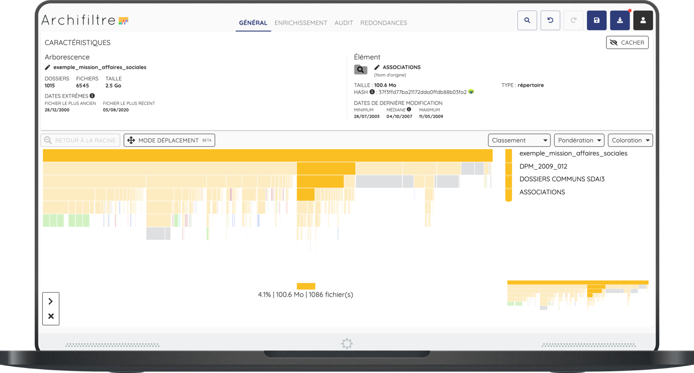

<h1 align="center">
  <p align="center">Docs par Archifiltre</p>
</h1>

<p align="center">
  <a href="https://github.com/SocialGouv/archifiltre-docs/actions/"></a>
  <a href="https://github.com/SocialGouv/archifiltre-docs/actions/"></a>
  <a href="https://opensource.org/licenses/Apache-2.0"></a>
  <a href="https://img.shields.io/github/v/release/SocialGouv/archifiltre-docs"></a>
  <a href="https://codecov.io/gh/SocialGouv/archifiltre-docs"></a>
  <a href="https://code.gouv.fr/fr/awesome/"></a>
</p>

<br>

Docs by Archifiltre allows you to visualize and improve your file trees. Learn more about it [here](https://archifiltre.fabrique.social.gouv.fr/).



## 🚀 Launch the app

First install the dependencies

```bash
yarn
```

Then copy the dist env file

```bash
cp .env.dist .env
```

(Optional) Instal react devtools

```bash
yarn devtools
```


You should use auto reloading when developing, using

```bash
yarn dev
```

and then, reload your electron app with the refresh command (`CMD + R` on MacOS)

You can make the app automatically load a specific folder by doing:

```bash
AUTOLOAD="/absolute/or/relative/path/to/folder" yarn dev
```

You can automatically reload the previous session using :

```bash
AUTORELOAD=true yarn dev
```

(this envs can also be set in env file)

## ✨ Contributing

To contribute, see more [here](CONTRIBUTING.md)

To know more about the project architecture, go [here](docs/README.md)

## 📝 Import script

Docs provides you with an export script that you can run directly on your file server. To know more about it, go [here](scripts/README.md)
