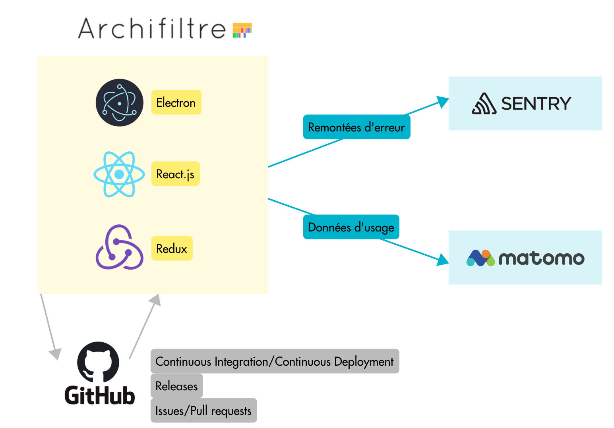

## Architecture

Archifiltre uses :
- Electron to package Javascript code and make binaries for desktop applications
- React.js for the UI 
- Redux for internal data management

We use GitHub services to handle :
- Continuous integration/Continuous deployment
- Builds and releases
- Issues and pull requests for external contrubutions
- A wiki for documentation
- The "Project" feature for a roadmap
- Security features like CodeQL and dependabot

Finally, we send data to external services:
- Sentry for logging execution errors
- Matomo to get usage statistics

Both of these options can be disabled by the user
